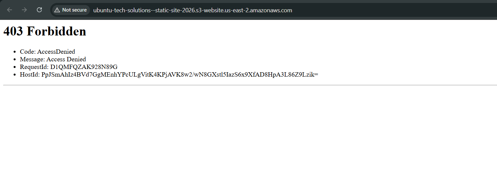
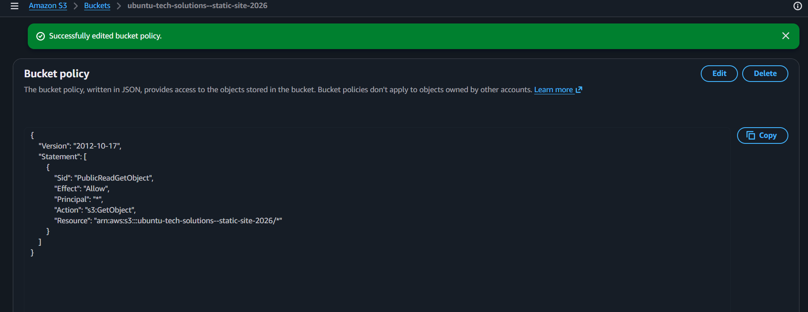
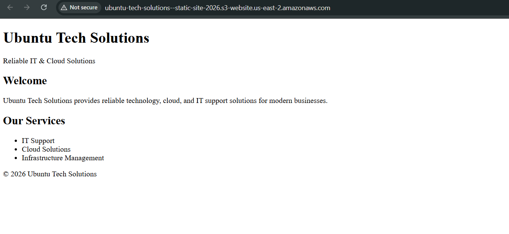

## Troubleshooting: 403 Access Denied

After uploading the website files and enabling static website hosting, the S3 website endpoint returned a **403 Access Denied** error instead of loading `index.html`.



### Diagnosis

At first glance this looked like a public access problem, but the bucket's **Block Public Access** setting was already disabled — that part had been configured correctly when the bucket was created.

The actual issue was that disabling Block Public Access only *allows* a public policy to be applied to the bucket — it does not, on its own, grant public read access to objects. Without an explicit bucket policy authorizing `s3:GetObject`, S3 still denies anonymous requests by default, which is why the endpoint returned a 403 even though "public access" was technically turned on.

### Fix

A bucket policy was added to explicitly grant public read access to objects in the bucket:

```json
{
  "Version": "2012-10-17",
  "Statement": [
    {
      "Sid": "PublicReadGetObject",
      "Effect": "Allow",
      "Principal": "*",
      "Action": "s3:GetObject",
      "Resource": "arn:aws:s3:::YOUR-BUCKET-NAME/*"
    }
  ]
}
```



After attaching this policy, the website endpoint was reloaded and the page rendered correctly.



### Takeaway

Turning off Block Public Access and attaching a public bucket policy are two separate steps, and both are required for a static website bucket to actually serve content publicly. Skipping the policy step is a common cause of "I disabled public access but my site still won't load" issues — worth checking first before assuming there's a deeper permissions or DNS problem.
